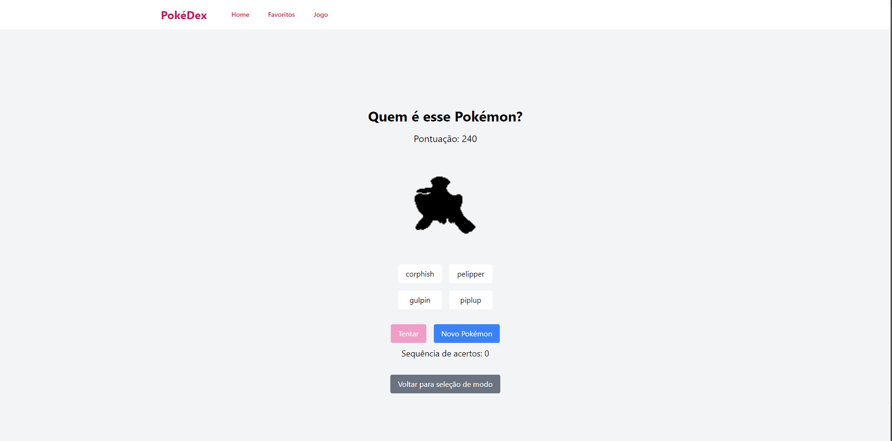

# PokePoke

Este é um projeto de faculdade com objetivo de consumir o pokeAPI e permitir visualização de pokemons desenvolvido com React, TypeScript e Vite. Implementei também um modo de jogo permite que os usuários joguem o jogo "Quem é esse pokemon ?" com seus Pokémon favoritos ou com todos os Pokémon disponíveis, testando seus conhecimentos sobre as criaturas do universo Pokémon.

## Tecnologias Utilizadas

- **React**: Biblioteca JavaScript para construir interfaces de usuário.
- **TypeScript**: Superset do JavaScript que adiciona tipagem estática.
- **Vite**: Ferramenta de construção que fornece um ambiente de desenvolvimento rápido e otimizado.
- **Tailwind CSS**: Framework CSS para estilização rápida e responsiva.

## Funcionalidades

- **Tela Inicial**: Apresenta uma lista de Pokémon com a opção de favoritar.
- **Tela de Favoritos**: Exibe os Pokémon que o usuário marcou como favoritos.
- **Modo de Jogo**: Permite que o usuário jogue "Quem é esse Pokémon?" com opções de jogar com favoritos ou com todos os Pokémon.

## Imagens de Demonstração

### Tela Inicial (Desktop)


### Tela Inicial (Mobile)


### Tela de Favoritos


### Modo de Jogo


### Exemplo de Jogo - Tentativa 1


### Exemplo de Jogo - Tentativa 2


## Como Executar o Projeto

1. Clone o repositório:
   ```bash
   git clone https://github.com/MatheusRicardoCarvalho/PokePoke.git
   ```

2. Navegue até o diretório do projeto:
   ```bash
   cd Pokepoke
   ```

3. Instale as dependências:
   ```bash
   npm install
   ```

4. Inicie o servidor de desenvolvimento:
   ```bash
   npm run dev
   ```

5. Acesse o aplicativo no seu navegador em `http://localhost:3000`.
